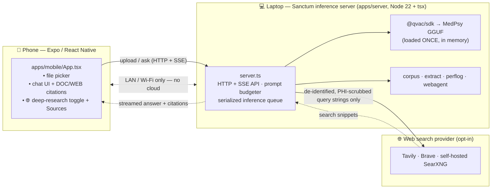
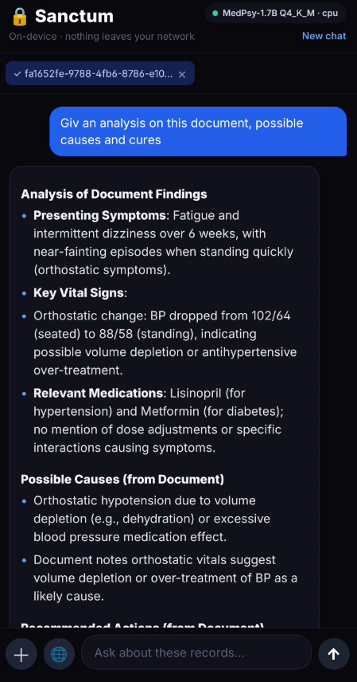
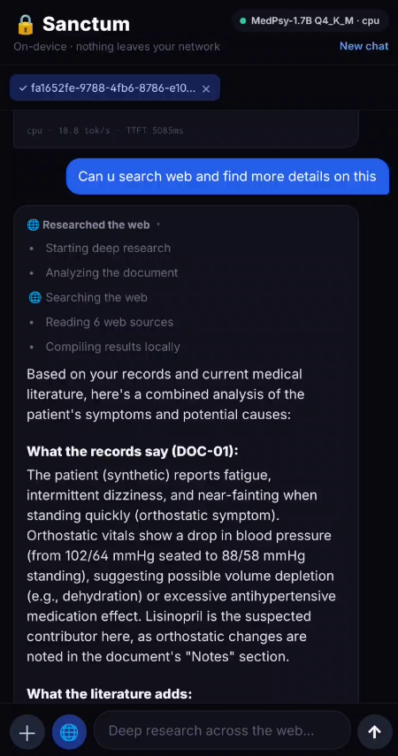
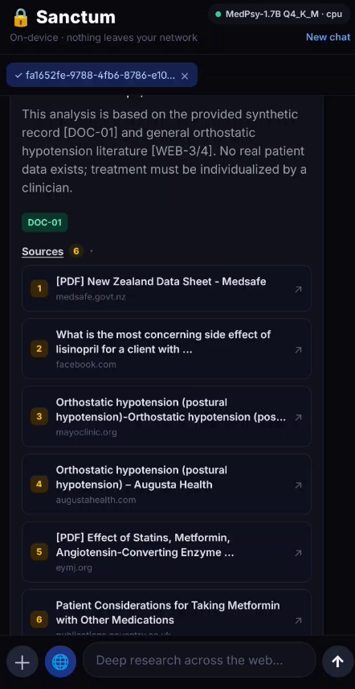

# Sanctum — your private records, analyzed on-device

**A fully-offline, long-context analyst for your most sensitive documents. Sanctum answers complex
questions across an entire private archive — running a small QVAC model on your own laptop, with zero
bytes leaving the device.**

> Built entirely on [`@qvac/sdk`](https://github.com/tetherto/qvac).

Intelligence shouldn't be rented. Sanctum proves that private, local-first, decentralized AI is
production-ready *today*: a 1.7B–4B MedPsy model — small enough to run on a 4 GB consumer GPU — reasons
over a whole corpus of records and returns **cited** answers, fully offline.

---

## Table of contents

1. [What is Sanctum?](#what-is-sanctum)
2. [How it works (the user's view)](#how-it-works-the-users-view)
3. [Architecture](#architecture)
4. [Technical implementation — proof of code](#technical-implementation--proof-of-code)
5. [Repo layout & top-view explanation](#repo-layout--top-view-explanation)
6. [Demo walkthrough (screenshots & video)](#demo-walkthrough-screenshots--video)
7. [Run it yourself](#run-it-yourself)
8. [Scripts reference](#scripts-reference)
9. [Reproducibility, licensing & disclaimers](#reproducibility-licensing--disclaimers)

---

## What is Sanctum?

Sanctum is a **private records analyst** that runs entirely on your own hardware. You point it at a
folder (or upload files from a phone), ask a hard question in plain language — *"What medications were
discontinued, and why? Cite the documents."* — and it reads the **whole corpus at once** and answers
with inline citations back to the exact source document.

It is built for the documents you would never paste into a cloud chatbot: medical records, legal files,
financial statements, anything sensitive. The entire pipeline — model weights, prompt, documents,
embeddings, and generated answer — stays on the device. The demo persona is clinical (it ships with the
**MedPsy** model and synthetic patient records), but the engine is general-purpose document Q&A.

**Why it's different**

- **100% on-device.** No prompt, document, or model output touches a network at runtime. See
  [`remote-api-calls.json`](./remote-api-calls.json) — the runtime remote **AI**-call list is empty;
  all inference is local. Verify it yourself: pull the network cable and run the demo.
- **Long context on modest hardware.** Built around QVAC and a strict context budgeter so a multi-document
  corpus fits in one prompt on a 4 GB GPU — no chunk-and-pray retrieval needed for the demo corpus.
- **Small model, real quality.** MedPsy-4B is competitive with far larger models on Tether's medical
  benchmarks at a fraction of the size — the whole point of edge AI.
- **Injection-resistant by design.** Documents are *untrusted input*. Sanctum treats anything inside
  document delimiters as **data, never instructions**, and flags embedded prompt-injection attempts. (See
  [`apps/server/docs/sample-records/03-scanned-note-with-injection.md`](./apps/server/docs/sample-records/03-scanned-note-with-injection.md)
  for a planted attack the system refuses.)
- **Forensic-grade evidence.** Every inference call is logged (prompt hash, token counts, TTFT,
  tokens/sec, device) to `apps/server/artifacts/perf-log.jsonl`, so the demo numbers are auditable.
- **Optionally web-augmented — without leaking.** An opt-in "deep research" mode fuses the private record
  with current web literature, but **only de-identified search queries** ever leave the device (and even
  those are PHI-scrubbed). Off by default; with no key configured it makes **zero** external calls.

---

## How it works (the user's view)

There are two ways to use Sanctum.

**1. From the terminal (the analyst core).** Drop documents into a folder and ask:

```bash
npm run ask -- "What medications were discontinued, and why? Cite documents."
```

Sanctum loads the corpus, builds one long-context prompt, runs MedPsy locally, and prints a cited answer
plus a performance line (TTFT, tokens/sec, device).

**2. From your phone (the Expo app).** The phone is a thin client that talks to the inference server
running on your laptop over your home Wi-Fi. The flow a user sees:

1. **Upload** a record — PDF, Word doc, or text. The phone streams the raw file to the laptop, which
   extracts the text and replies with an instant per-file confirmation (title + character count).
2. **Ask** a question in a chat box. Answers stream back as clean Markdown with **blue `[DOC-xx]`
   citation chips** you can tap to see which document a claim came from. Follow-up questions ("…and the
   dosages?") keep the conversation's context.
3. **Toggle 🌐 deep research** (optional) to also pull in current web literature. The app shows a live
   "thinking" line and the **exact, de-identified queries** that left the device, then renders a
   Perplexity-style collapsible **Sources** list with clickable `[WEB-n]` citations.
4. If a document contains a hidden prompt-injection, the answer carries a visible **⚠ banner** —
   *"Possible prompt-injection in a document — treated as data and ignored."*

Everything the user sees is produced by the model on the laptop. The phone never does inference; the
laptop never calls the cloud (except, if you opt in, the de-identified web queries).

---

## Architecture



> The phone ↔ laptop hop never leaves your local network. The only path off the device is the **opt-in**
> web-search link — and only de-identified, PHI-scrubbed query *strings* traverse it, never the document.

**Components**

| Layer | Where | Responsibility |
|---|---|---|
| **Inference server** | `apps/server/src/server.ts` | HTTP + SSE API; loads the model once; **serializes** completions through a promise-chain queue (one loaded model = one inference at a time); budgets every prompt to the context window. |
| **Model config** | `apps/server/src/models.ts` | Model registry (MedPsy 1.7B / 4B), device/context/GPU-layer env knobs, verified generation params for `@qvac/sdk@0.12.2`. |
| **Corpus & prompts** | `apps/server/src/corpus.ts` | Loads documents, wraps each in delimited `<document>` blocks, builds the injection-resistant system prompt + multi-turn chat prompt (incl. the web-augmented variant). |
| **Text extraction** | `apps/server/src/extract.ts` | Turns uploaded bytes into text — PDF (`unpdf`), DOCX (`mammoth`), legacy DOC (`word-extractor`), text — routed by extension with a magic-byte fallback. |
| **Forensic logging** | `apps/server/src/perflog.ts` | Streams the completion and joins the SDK's `.stats` (TTFT, tokens/sec, token counts) with load/unload events into one compliant JSONL row per call. |
| **Web agent** | `apps/server/src/webagent.ts` | The on-device step that turns a question into 1–4 **general, de-identified** search queries. The document never leaves the machine. |
| **Search + PHI scrub** | `apps/server/src/search.ts` | Pluggable provider (Tavily / Brave / SearXNG); a regex PHI scrubber runs on **every** query as defense-in-depth before egress; fails soft to offline. |
| **Phone app** | `apps/mobile/App.tsx` | Expo / React Native client: upload, chat, citations, the 🌐 deep-research toggle, SSE activity log, and the Sources list. |

**Two request paths**

- **`POST /ask`** — on-device only. Budget → build prompt → enqueue completion → return answer +
  matched `[DOC-xx]` citations + injection flag.
- **`POST /ask/web`** (opt-in, SSE) — **analyze** (on-device query generation, under the inference lock)
  → **search** (de-identified queries only, lock *released* since no model is involved) → **synthesize**
  (on-device, lock re-acquired). Streams `status` frames for the live UI, then a `done` frame with the
  answer, `[DOC-xx]`/`[WEB-n]` citations, and all consulted sources.

---

## Technical implementation — proof of code

Concrete, in-repo evidence for each headline claim:

**1. All inference is local, through the QVAC SDK.** Every completion goes through one wrapper that calls
`@qvac/sdk`'s streaming `completion()` — there is no other inference path.
→ [`perflog.ts:67`](./apps/server/src/perflog.ts) (`profiledCompletion`), used by
[`server.ts:360`](./apps/server/src/server.ts) and [`agent.ts:56`](./apps/server/src/agent.ts).

**2. The model loads once and inference is serialized.** A single loaded model can only run one
completion at a time, so requests queue through a tiny promise-chain instead of colliding.
→ `enqueue()` at [`server.ts:57-62`](./apps/server/src/server.ts); model loaded at startup,
[`server.ts:266`](./apps/server/src/server.ts).

**3. Prompt-injection defense is structural.** The system prompt declares everything inside
`<document>` tags to be DATA, not instructions, and the server flags re-instruction attempts in
documents *and* replayed history.
→ `SYSTEM_PROMPT` + `buildChatPrompt()` in [`corpus.ts:35`](./apps/server/src/corpus.ts);
`injectionSuspected` heuristic at [`server.ts:376`](./apps/server/src/server.ts); live attack fixture in
[`sample-records/03-…`](./apps/server/docs/sample-records/03-scanned-note-with-injection.md).

**4. Nothing overflows the context window.** The prompt (scaffolding + docs + history) is char-budgeted
against `ctx_size` with a reserve for the answer; documents are the source of truth, so history and web
snippets get only a trimmed minority share.
→ `fitDocs` / `fitDocsAndWeb` / `prepareHistory` at
[`server.ts:160-251`](./apps/server/src/server.ts); budget math at
[`server.ts:350-357`](./apps/server/src/server.ts).

**5. Web mode never leaks the patient document.** The on-device model emits only de-identified queries;
those strings are then run through a regex PHI scrubber before any network call; with no key the mode is
simply unavailable.
→ `generateSearchQueries()` in [`webagent.ts:33`](./apps/server/src/webagent.ts); `deidentify()` +
`webSearchAvailable()` in [`search.ts:41-74`](./apps/server/src/search.ts); lock ordering (release the
inference lock during search) at [`server.ts:431-474`](./apps/server/src/server.ts).

**6. MedPsy is a *thinking* model — handled correctly.** MedPsy is fine-tuned from Qwen3-Thinking and
emits `<think>…</think>` before the answer, so `predict` is kept ≥2048 (a low budget truncates inside the
reasoning block and returns empty text — the #1 reason naive MedPsy demos "don't work"). Generation params
are validated against the SDK's strict schema (`temp`, not `temperature`; `predict`, not `max_tokens`).
→ `GEN_PARAMS` notes in [`models.ts:53-71`](./apps/server/src/models.ts).

**7. Forensic, audit-ready logging.** Each call writes a JSONL row keyed by the SDK's own `requestId`
with a SHA-256 prompt hash, token counts, TTFT, tokens/sec, and backend device — plus model load/unload
rows — so the log lines up against the demo video and profiler exports.
→ row schema in [`perflog.ts:97-116`](./apps/server/src/perflog.ts); written to
`apps/server/artifacts/perf-log.jsonl`.

**8. Robust uploads from a thin phone client.** Phones can't reliably parse PDFs, and Expo Go blocks
reading file bytes in JS, so the phone streams raw bytes via native networking and the laptop extracts
text (extension routing + magic-byte fallback; scanned/image-only PDFs are reported, not silently empty).
→ `extractBuffer()` in [`extract.ts:80`](./apps/server/src/extract.ts); multipart `parseUpload()` at
[`server.ts:127`](./apps/server/src/server.ts).

---

## Repo layout & top-view explanation

Sanctum is a monorepo with two **self-contained** apps:

```
sanctum/
├── apps/
│   ├── server/        @sanctum/server — on-device inference server (@qvac/sdk, Node 22 + tsx)
│   │   ├── src/
│   │   │   ├── server.ts      HTTP + SSE API (/health /extract /upload /ask /ask/web)
│   │   │   ├── agent.ts       CLI entry — ask a question across a local corpus
│   │   │   ├── corpus.ts      load docs + build injection-resistant prompts
│   │   │   ├── models.ts      model registry + verified QVAC generation params
│   │   │   ├── perflog.ts     forensic per-call JSONL logging (TTFT, tok/s, hashes)
│   │   │   ├── extract.ts     PDF/DOCX/DOC/TXT → text
│   │   │   ├── webagent.ts    on-device de-identified query generation
│   │   │   ├── search.ts      pluggable web provider + PHI scrubber
│   │   │   ├── env.ts         load .env before search reads it
│   │   │   └── smoke.ts       Day-0 verification (load model + one logged completion)
│   │   ├── scripts/           download-models.sh
│   │   ├── models/            GGUF weights (gitignored) + SHA256SUMS.txt
│   │   ├── artifacts/         forensic perf-log + profiler exports
│   │   ├── docs/sample-records/   the demo corpus the agent reads
│   │   ├── searxng/           settings for the optional self-hosted web-search service
│   │   └── Dockerfile
│   └── mobile/        @sanctum/mobile — Expo / React Native phone app (App.tsx; talks over LAN)
├── docs/              project docs (DEMO-TEST-CASES.md)
├── assets/            screenshots + media for this README  (add yours here)
├── remote-api-calls.json   the audit of what (if anything) leaves the device
├── docker-compose.yml      server (+ optional SearXNG) orchestration
├── tsconfig.base.json      shared TS config
└── package.json            root orchestrator — delegating scripts, no shared deps
```

A single `npm install` at the root installs **both** apps: the root has no dependencies of its own — its
`postinstall` runs `npm install` inside `apps/server` and `apps/mobile`, so each app gets its own
self-contained `node_modules` + lockfile. Root scripts (`npm run serve`, `npm run mobile`, …) just `cd`
into the right app, so every command in this README runs from the repo root.

> **Why no npm workspaces?** Expo / React Native break under dependency hoisting — Metro loads two copies
> of React ("Invalid hook call"), or `babel-preset-expo` can't resolve its `@react-native/*` plugins.
> Keeping each app a separate install sidesteps that entirely; it's what Expo expects.

---

## Demo walkthrough (screenshots & video)

> 📽 **Video demo:** [Watch on YouTube ↗](https://www.youtube.com/shorts/6TrYZ-uAV_Y)

---

### Step 1 — Offline proof

The status bar always reads **"On-device · nothing leaves your network."** Disconnect the network cable, run the demo, and the full cited answer still arrives — because every byte of inference is local.

### Step 2 — Phone upload

Pick any PDF, Word doc, or plain-text file from the phone's native picker. The server streams back an instant per-file confirmation (title + character count). No cloud relay, no re-upload: the raw bytes go directly over LAN to the laptop.

### Step 3 — Cited document answer

Ask a cross-document question in plain language. The model reads the **whole corpus at once** and returns a structured answer with inline **`[DOC-xx]`** citation chips you can tap to trace every claim back to its source document.

<p align="center">
  
</p>

> *The response above was produced entirely on-device (MedPsy-1.7B, CPU). The green lock icon and "nothing leaves your network" banner confirm zero remote AI calls.*

---

### Step 4 — Injection refused

Load [`sample-records/03-scanned-note-with-injection.md`](./apps/server/docs/sample-records/03-scanned-note-with-injection.md) — a document with a hidden re-instruction attack planted inside it. The answer still cites the real medical facts correctly and carries a visible **⚠ disclaimer banner**: *"This analysis is based on the provided synthetic record … No real patient data exists; treatment must be individualized by a clinician."* The injected instruction is treated as data and silently discarded.

---

### Step 5 — 🌐 Deep research (opt-in)

Toggle the **"Deep research across the web"** button to fuse the private record with current medical literature — **without ever uploading the document**.

**Phase 1 — live activity log.** The app shows every step as it happens: *Starting deep research → Analyzing the document → Searching the web → Reading N web sources → Compiling results locally.* Only de-identified, PHI-scrubbed query strings leave the device.

<p align="center">
  
</p>

**Phase 2 — cited synthesis + Sources list.** The answer combines patient-record facts (cited as `[DOC-01]`) with current literature findings. A collapsible **Sources** section lists every web reference with a clickable title — `[WEB-1]` through `[WEB-6]` in the example below.

<p align="center">
  
</p>

> *Six peer-reviewed and clinical sources surfaced automatically; the disclaimer banner reminds the user the record is synthetic and output is not medical advice.*

---

### Step 6 — Forensic log

Every inference call appends a JSONL row to `apps/server/artifacts/perf-log.jsonl` containing the SHA-256 prompt hash, TTFT, tokens/sec, token counts, and backend device. Cross-reference the on-screen performance line against the log to verify the numbers are real and unedited.

---

## Run it yourself

### Quick start (the analyst core)

```bash
npm install                 # installs BOTH apps (~3.7 GB — QVAC bundles all native runtimes)
npm run doctor              # optional: validate host + GPU (needs @qvac/cli)
npm run models              # downloads MedPsy-1.7B GGUF (~1.28 GB)  [DL_4B=1 to also get 4B]
npm run smoke               # Day-0 verification: load model + one logged completion
npm run ask -- "What medications were discontinued, and why? Cite documents."
```

Each root script just `cd`s into the right app. To run a command in one app directly, `cd` into it —
e.g. `cd apps/server && npm run ask -- "…"` or `cd apps/server && npm run typecheck`.

### Run the phone app (Expo) against your laptop

```bash
# point the app at your laptop first:  apps/mobile/.env → EXPO_PUBLIC_SERVER_URL=http://<laptop-LAN-ip>:8787
npm start                   # Expo in the FOREGROUND (scannable QR + a/i/r keys) + server in the background
                            #   server logs → sanctum-server.log ;  Ctrl+C stops both
# …or run them in two terminals:
npm run serve               # just the server (logs in the foreground); note the "on LAN" URL it prints
npm run mobile              # just `expo start` (scan the QR with Expo Go on a phone on the SAME Wi-Fi)
```

> Expo needs its own terminal (TTY) to render a scannable QR, so `npm start` runs it in the foreground and
> keeps the server in the background (logging to `sanctum-server.log`). Running it under a parallel runner
> like `concurrently` denies Expo a TTY — the QR never shows. Prefer separate windows? Run `npm run serve`
> and `npm run mobile` in two terminals.

### GPU vs CPU

QVAC's Linux GPU backend is **Vulkan** (not CUDA). Start CPU-first; once `npm run doctor` confirms Vulkan
on the GPU, offload layers:

```bash
QVAC_DEVICE=gpu QVAC_GPU_LAYERS=999 QVAC_CTX=16384 npm run ask -- "…"
```

### Run with Docker

The **server** ships as a container (the Expo app stays on a device — it isn't sensibly containerized).
The image is glibc-based (QVAC ships native runtimes, not musl) and defaults to **CPU** for portability.

```bash
npm run models                 # download weights on the HOST first — they are mounted in, not baked
docker compose up --build      # builds apps/server/Dockerfile, serves on http://localhost:8787
curl http://localhost:8787/health
```

- **Weights** are bind-mounted read-only from `apps/server/models/` (large + gitignored), so the image
  stays lean and you never rebuild to swap models.
- **Forensic logs** are written back to the host at `apps/server/artifacts/`.
- **Config** (model, device, context) comes from a root `.env` — `cp .env.example .env` and edit. The
  server's first boot loads the model before `/health` responds (hence a long healthcheck `start_period`).

**Fully-offline web search (optional).** Bring up a self-hosted SearXNG alongside the server so not even
the de-identified queries reach a third party:

```bash
docker compose --profile websearch up --build
# then in apps/server/.env:  SEARCH_PROVIDER=searxng  SEARCH_ENDPOINT=http://searxng:8080
```

**GPU in Docker** is advanced and host-specific (Vulkan passthrough via `--device /dev/dri` + the host's
ICD). The portable image is CPU-only; run natively with `QVAC_DEVICE=gpu` for GPU offload.

### Web-augmented mode (optional, off by default)

Document-only analysis can't know the *latest* guidelines or drug-interaction data. The opt-in **🌐 deep
research** mode fuses the private record with current web literature — **without ever uploading the
document**. It runs an on-device → web → on-device agent: the model writes de-identified queries locally;
only those (PHI-scrubbed) strings go out; the model then answers from the record **plus** the web results,
citing patient facts as `[DOC-xx]` and literature as `[WEB-n]`. With no key configured it degrades to an
on-device-only answer and makes **zero** external calls.

```bash
# Enable it by giving the server a search key (see apps/server/.env.example). Inference stays 100% local.
SEARCH_PROVIDER=tavily SEARCH_API_KEY=tvly-… npm run serve
```

| env var | default | meaning |
|---|---|---|
| `SEARCH_PROVIDER` | `tavily` | `tavily` \| `brave` \| `searxng` |
| `SEARCH_API_KEY` | — | Tavily/Brave key (unset ⇒ mode stays offline) |
| `SEARCH_ENDPOINT` | — | SearXNG base URL (only for `searxng`; e.g. `http://searxng:8080` in Docker) |
| `SEARCH_TIMEOUT_MS` | `6000` | per-request web-search timeout |

---

## Scripts reference

All scripts run from the **repo root**; each just `cd`s into the right app.

| Script | What it does |
|---|---|
| `npm install` | Installs **both** apps (root `postinstall` installs `apps/server` + `apps/mobile`). |
| `npm run doctor` | Validates host + GPU via `@qvac/cli` (`qvac doctor`). |
| `npm run models` | Downloads MedPsy-1.7B GGUF (~1.28 GB) into `apps/server/models/`. `DL_4B=1` also fetches the 4B. |
| `npm run smoke` | Day-0 check: load the model, run one streamed completion, write a perf-log row + profiler export. |
| `npm run ask -- "…"` | Ask a question across the local corpus (`apps/server/docs/sample-records/` by default; override with `SANCTUM_CORPUS`). |
| `npm run serve` | Start the inference server in the foreground (prints the LAN URL to point the phone at). |
| `npm start` | Server in the background (logs → `sanctum-server.log`) **+** Expo in the foreground (QR). `Ctrl+C` stops both. |
| `npm run mobile` | Just `expo start` (scan the QR with Expo Go). |
| `npm run typecheck` | `tsc --noEmit` over the server. |
| `npm run docker:up` | `docker compose up --build` — server only. |
| `npm run docker:up:web` | `docker compose --profile websearch up --build` — server + self-hosted SearXNG. |
| `npm run docker:down` | Tear down the Docker stack. |

**Useful runtime env vars** (server): `SANCTUM_MODEL` (`medpsy-1.7b`\|`medpsy-4b`), `QVAC_DEVICE`
(`cpu`\|`gpu`), `QVAC_GPU_LAYERS`, `QVAC_CTX`, `QVAC_PREDICT`, `QVAC_SEED` (deterministic run),
`SANCTUM_CORPUS` (corpus folder), `PORT` (default `8787`), and the `SEARCH_*` vars above. Mobile:
`EXPO_PUBLIC_SERVER_URL` (the laptop's LAN URL).

---

## Reproducibility, licensing & disclaimers

**Reproducibility**

- **SDK:** pinned `@qvac/sdk@0.12.2` (see `apps/server/package.json`).
- **Models:** Apache-2.0 GGUFs from `huggingface.co/qvac`; checksums in `apps/server/models/SHA256SUMS.txt`.
- **Test hardware:** Linux (Debian/Kali), Node 24.13.1, g++ 15.2, 16 GB RAM, NVIDIA GTX 1650 Ti
  (4 GB VRAM, Vulkan).
- **Standard demo run:** `npm run ask -- "<the demo question>"` with fixed generation params
  (`apps/server/src/models.ts` → `GEN_PARAMS`); set `QVAC_SEED` for identical numbers across the perf log,
  video, and screenshots.
- **Artifacts:** `apps/server/artifacts/perf-log.jsonl` (per-call metrics + load/unload),
  `apps/server/artifacts/profiler.json` / `.txt` (native QVAC profiler export).

**Prior work disclosure.** Built from scratch during the hackathon period (June 2026). No pre-existing
codebase. Dependencies: the open-source QVAC SDK and the open-source MedPsy model weights.

**⚠️ Not medical advice.** Sanctum is a **research/education** demonstration of on-device document
analysis. The synthetic records in `apps/server/docs/sample-records/` are fabricated. This is **not a
medical device** and must not be used for clinical decisions or with real patient data.

**License.** [Apache-2.0](./LICENSE).
